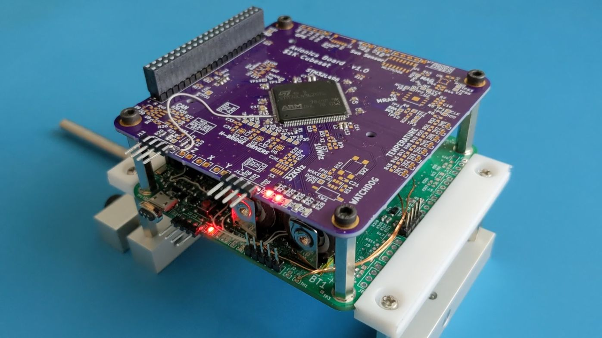

# 1KCubeSat_Hardware

Hardware design files for my $1000 cubesat.

Schematics & Layouts are done using KiCad V5.1+

## ½ CubeSat

My progress so far, what I'm calling the ½ Cubesat. The [avionics board](avionics_board) is stacked on the [eps board](eps_board)

## Radio Board

See [my fork of the OpenLST repo](https://github.com/rgw3d/openlst-hw/tree/1kcubesat-updates) for more information!

