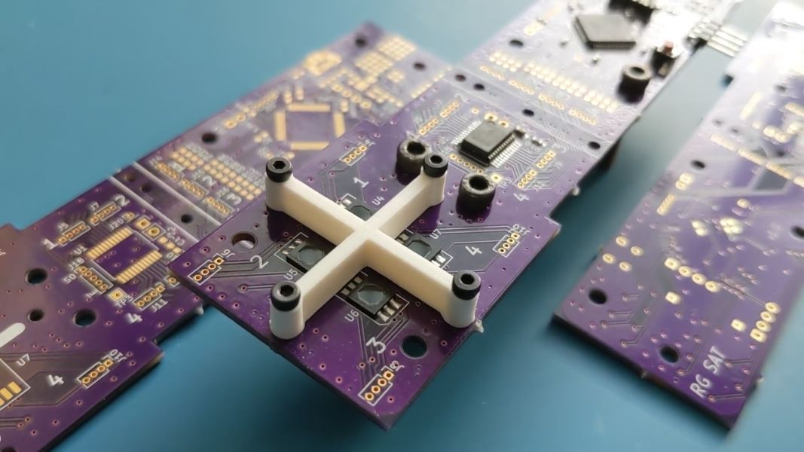

# Sun Sensor Test

Testing out a potential sun sensor using the K857PE 4-Quadrent Photodiode. See the [pdf](https://raw.githubusercontent.com/rgw3d/1KCubeSat_Hardware/master/sun_sensor_test/sun_sensor_test.pdf) for more information.

See [my video on this board](https://www.youtube.com/watch?v=8ttuiI6RIH0) for more information.

